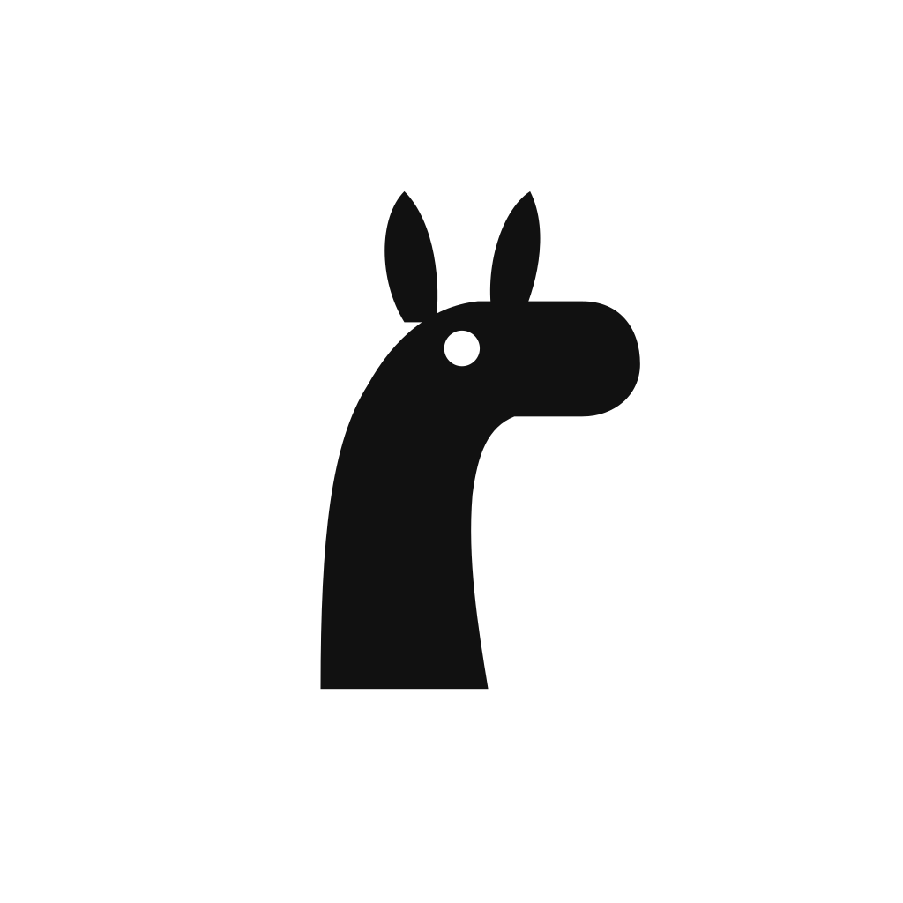

<p align="center"></p>

# Oh My Llama

An unofficial rebuild of the macOS [Ollama](https://github.com/ollama/ollama) app
that carries a couple of patches upstream has not taken, and that updates itself
on its own channel so a stock Ollama update can never replace it.

**Not affiliated with, sponsored by, or endorsed by Ollama.** Ollama is
MIT-licensed; see [LICENSE](LICENSE) and
[THIRD-PARTY-LICENSES.md](THIRD-PARTY-LICENSES.md).

## What is different

- **Single-dollar inline LaTeX** in chat rendering (`$x^2$`, not just `$$x^2$$`) —
  upstream [PR #17090](https://github.com/ollama/ollama/pull/17090).
- **`OLLAMA_KEEP_ALIVE` is configurable in Settings** and persists, instead of
  being environment-only. An explicit environment variable still wins.
- Own name, icon, bundle identifier and update feed, so it installs and updates
  side by side with a stock Ollama.

Everything else is upstream, unmodified.

## Install

Download the latest `OhMyLlama.dmg` from
[Releases](https://github.com/0xfede/oh-my-llama/releases/latest).

The build is **ad-hoc signed rather than notarized** (no paid Apple Developer
account), so Gatekeeper blocks the first launch on each Mac. Right-click the app
and choose **Open** once, or:

```sh
xattr -dr com.apple.quarantine /Applications/OhMyLlama.app
```

Later updates install themselves in place and need no such step — in-place
updates are not quarantined, and the updater's signature check accepts an ad-hoc
signature.

### Running alongside stock Ollama

The two are separate apps with different bundle identifiers and can both be
installed. They do **share** `~/.ollama` and port 11434, so only one should run at
a time — whichever starts first claims the port. Oh My Llama warns in its log if
it sees stock Ollama running, and, unlike stock Ollama, never terminates the other
app's processes.

Both install the CLI as `/usr/local/bin/ollama`; the last one to be launched owns
that symlink.

## How releases work

The fork branch is always *an upstream release tag plus our patch commits*, with
the current base recorded in [UPSTREAM_VERSION](UPSTREAM_VERSION).

1. [`oh-my-llama sync`](.github/workflows/oh-my-llama-sync.yaml) checks upstream
   every 6 hours. On a new release it rebases the patch commits onto the new tag
   and pushes an `omll-v*` tag. If a patch stops applying it opens an issue and
   pushes nothing.
2. [`oh-my-llama release`](.github/workflows/oh-my-llama-release.yaml) builds
   arm64, ad-hoc signs, and publishes a release plus `update.json`.

Versions are `<upstream>-omll.<n>`, e.g. `0.32.4-omll.1`. semver reads `-omll.n`
as a prerelease, which orders both dimensions correctly: within one upstream
release `omll.2` beats `omll.1`, and any `0.32.5-omll.1` beats every
`0.32.4-omll.n`.

Installed copies poll `update.json` on the latest release. Because a static file
cannot answer "you are already current" the way Ollama's endpoint does, the client
compares versions itself (`isNewer` in [app/updater](app/updater/updater.go)).

## Building locally

Needs Xcode command line tools, Go (see `go.mod`), Node, and cmake.

```sh
VERSION=0.32.4-omll.1 ./scripts/build_darwin.sh -a arm64
```

Output lands in `dist/`. With no `APPLE_IDENTITY` set the bundle is ad-hoc signed
and the build fails if that signature does not verify, since the updater would
reject it.

To regenerate the icons from their SVG sources (needs `brew install librsvg`):

```sh
./app/assets/omll/generate-icons.sh
```

## Rebasing onto a new upstream release by hand

Fork-specific identity is centralized in
[app/branding/branding.go](app/branding/branding.go) and
[app/branding/branding.h](app/branding/branding.h) so that a rebase touches as
little as possible. The patches that do touch upstream files are the two feature
patches, the branding call sites, and `scripts/build_darwin.sh`.
